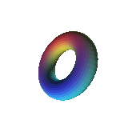
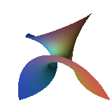

# Mathematical surface frames

The `rough-surface` native program is a **source stage** for the framebuffer's
existing `P` (RGB pen) and `T` (depth-tested triangle) operation stream. It
does not implement its own pixel plotting, depend on JavaScript/Processing.js,
or replace the native Field Mouse (Idriç) geometry source.

## Generate a frame

From the repository root, after `make`:

```sh
./build/rough-surface enneper 25 320 240 > build/enneper-25.ops
./build/rough-fb build/enneper-25.ops build/enneper-25.ppm 320 240

./build/rough-surface torus 60 320 240 > build/torus-60.ops
./build/rough-fb build/torus-60.ops build/torus-60.ppm 320 240
```

Replace `25` or `60` with any finite angle in degrees to produce a different
frame. Angles differ by exactly 360 degrees produce the same operation stream
in the same execution environment. For controlled near-plane inspection use
an optional sixth argument: camera distance, e.g.
`./build/rough-surface torus 30 320 240 0.55`.
The default distance is 5.2.

The `rough-fb` invocation is the existing portable PPM inspection path. A
native Android framebuffer consumer would use the exact same stream/triangle
rasterization, but no Android display, touch, or APK is added here.

## Actual renderer-produced previews

Both stills were generated by the native `rough-surface` producer and the
actual C depth/color renderer at source revision
`fe66c77b8914ed1bd040c2cbc4a52b5f0b2d93eb`,
under [hosted movie/preview run 38086392702](https://github.com/isomorphisms/rough.framebuffer/actions/runs/38086392702).
FFmpeg converted each rendered PPM into lossless RGB PNG; it did not draw the
surfaces.





The source PPM SHA-256 digests are:
torus `43583b686b7bb1c742dde96837a78dd10111f37513314ec58062ad7535fa0c7e`;
Enneper `cfa066970b829a8cf457ed63fa53b9fb4de1d090bb6b3cf24c6253bb4c84dd30`.

## Actual rotation movie

[Watch both mathematical surfaces rotating](../fixtures/previews/math-surfaces-rotation.mp4).
Each of the 24 frames renders a different angle with the existing native C
surface generator and depth-buffer rasterizer. FFmpeg only stacks the two
rendered panels and encodes the **2-second, 12-fps, 320×160 H.264** result.
The source MP4 SHA-256 is
`bac73eed2aaf32c040a0d346d8dd5e883b97792318a0473d89fc545435b20e15`.

The [finished-video contract](../fixtures/movie.contract.tsv) was verified by
the already existing ai-ci video decoder in
[hosted run 38086376013](https://github.com/isomorphisms/rough.framebuffer/actions/runs/38086376013):
all eight assertions passed. Decoded mean absolute RGB change between the
early and quarter-turn frames was **30.70** for the torus and **50.67** for
Enneper (out of 255). These are decoded artifact-level motion witnesses, not
claims about touch input or an Android renderer.

## Geometry and shading contract

- **Torus:** parameters \(u,v\) are periodic, with
  \(x=(1.18+0.43\cos v)\cos u\),
  \(y=(1.18+0.43\cos v)\sin u\), and \(z=0.43\sin v\).
- **Enneper minimal surface:** for \(u,v\in[-1.24,1.24]\), use
  \(x=0.85(u-u^3/3+uv^2)\),
  \(y=0.85(v-v^3/3+u^2v)\), and \(z=0.85(u^2-v^2)\).
- The camera looks along positive \(z\). Parameterized positions receive
  user-selected yaw around the \(y\) axis, a fixed pitch around \(x\), then a
  positive camera distance.
- Before perspective division, each source face is **clipped against
  \(z\geq0.5\)**. A clipped triangle becomes a three- or four-vertex polygon;
  the latter is emitted as two triangles. Clipping an edge always computes its
  intersection from the outside endpoint toward the inside endpoint.
- The perspective focal length is \(0.88\min(\text{width},\text{height})\).
  The emitted depth is \(1-0.5/z\): zero at the near plane, increasing toward
  one as \(z\) increases. This is affine in projected screen coordinates and
  uses the existing smaller-is-nearer barycentric depth test correctly.
- The emitted color is per-face, not per-pixel: a two-sided
  Lambertian diffuse term with ambient light modulates a smooth parameter
  palette with integer angular harmonics so the torus colors join across both\n  periodic parameter seams. Faces are not backface-culled; the existing z-buffer resolves
  visibility. This is **flat shading**, not yet smooth or normal-mapped shading.
- `rough_emit_surface` performs no image-sized allocations and emits a
  text stream to a caller-owned `FILE*`. All arguments are validated as
  finite, positive where required, and within supported image dimensions.

## Acceptance and limits

`make test` builds and runs the native producer/consumer regression. It
checks deterministic identical-angle streams, changed-angle frames, both
surfaces, finite and in-range projected coordinates/depth, near-plane
intersection, strict stream grammar, actual native framebuffer rasterization,
depth writes, and input rejection. Existing raster and Field Mouse tests retain
their distinct scope.

Still separate: hardware acceptance on MIRO A1, an on-device animated/touch UI, a general
mesh or camera API, perspective-correct *nondepth* attributes, antialiased
triangle edges, and smooth normals or advanced lighting.

Job envelope: [Flexible Pipes #70](https://github.com/isomorphisms/flexible-pipes/issues/70).
Implementation is stacked on framebuffer stroke PR #1 and depth PR #2.
[ai-ci draft PR #248](https://github.com/isomorphisms/ai-ci/pull/248)\nhas a hosted independent CPU reviewer for the exact pinned C source revision,\nincluding six deliberately bad mutants. This does **not** constitute\nFlexible Pipes registered dispatch, physical MIRO A1 acceptance, or an\nauthorized merge receipt.
